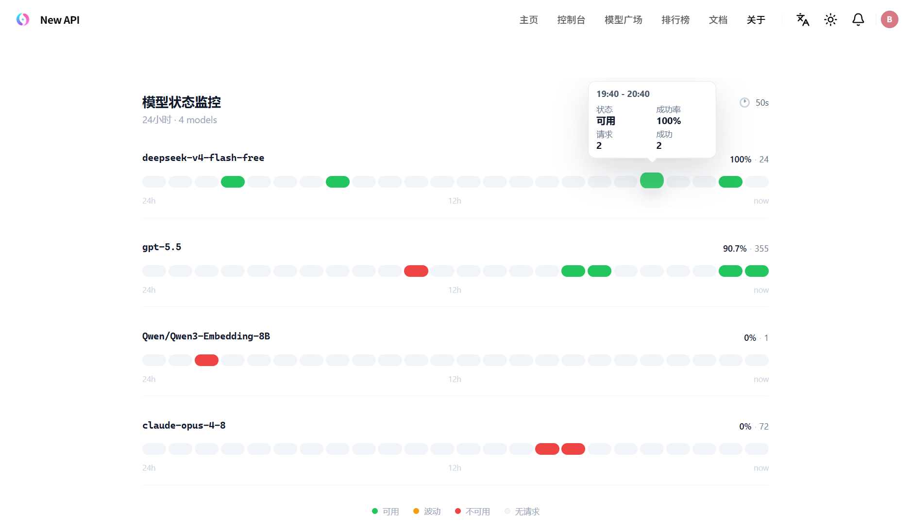

# NewAPI Model Monitor Lite

一个只保留模型状态监控和 iframe 嵌入页的轻量模块。

## 项目来源

本项目参考并精简自 [`new_api_tools`](https://github.com/james-6-23/new_api_tools) 项目中的模型状态监控能力，只保留适合独立部署和 iframe 嵌入的核心链路。相比完整的 `new_api_tools`，本项目不包含用户管理、充值统计、风控、兑换码等后台功能。



## 目标

- 旁路连接 NewAPI 数据库，不改 NewAPI 表结构。
- 从 `logs` 表聚合模型请求成功率。
- 暴露公开页面 `/embed`，供 NewAPI 后台通过 iframe 嵌入。
- 不包含用户管理、充值、风控、兑换码等其它后台功能。

## 运行配置

```env
SQL_DSN=host=postgres port=5432 user=postgres password=xxx dbname=new-api sslmode=disable
LOG_SQL_DSN=
SERVER_HOST=0.0.0.0
SERVER_PORT=1145
BASE_PATH=
PUBLIC_TITLE=模型状态监控
DEFAULT_MODELS=
DEFAULT_WINDOW=24h
REFRESH_SECONDS=60
MAX_MODELS=100
STATUS_TIMEOUT_SECONDS=15
MOCK_DATA=false
```

`LOG_SQL_DSN` 可选。NewAPI 如果启用了日志分库，应填写日志库连接串；为空时读取 `SQL_DSN` 指向数据库中的 `logs` 表。`BASE_PATH` 可选，例如设置为 `/model-monitor` 后，页面地址就是 `/model-monitor/embed`。
`MAX_MODELS` 用于限制 `/api/models` 和 `/api/status` 的模型数量，避免一次刷新聚合过多模型；`STATUS_TIMEOUT_SECONDS` 是 `/api/status` 的整体请求超时。

## 性能建议

`/api/status` 会按模型集合和时间槽一次性聚合 `logs` 表。生产环境建议给日志表补充适合监控查询的索引，例如：

```sql
CREATE INDEX idx_logs_monitor ON logs (model_name, created_at, type);
```

如果 `/api/models` 的模型发现查询更慢，也可以根据数据库执行计划额外考虑：

```sql
CREATE INDEX idx_logs_recent_models ON logs (created_at, type, model_name);
```

不同 MySQL/PostgreSQL 版本和数据分布下最佳索引可能不同，最终以 `EXPLAIN` 结果为准。

## 嵌入 NewAPI

部署后 iframe 地址：

```html
<iframe
  src="https://your-domain.example/model-monitor/embed"
  style="width:100%;height:720px;border:0;"
  loading="lazy"
></iframe>
```

默认 Docker 部署只绑定宿主机本机端口，不建议公网直接暴露 `1145`：

```html
<iframe
  src="http://127.0.0.1:1145/embed"
  style="width:100%;height:720px;border:0;"
  loading="lazy"
></iframe>
```

## API

| 方法 | 路径 | 说明 |
|---|---|---|
| `GET` | `/api/health` | 健康检查 |
| `GET` | `/api/models` | 最近 24 小时出现过请求的模型 |
| `GET` | `/api/config` | 前端公开配置 |
| `POST` | `/api/status` | 批量查询模型状态 |

## NewAPI 菜单接入思路

在 NewAPI 里新增一个后台菜单或页面，内容只放 iframe。推荐用反向代理把本服务挂到 NewAPI 同域路径，例如：

```text
/model-monitor/ -> http://127.0.0.1:1145/
```

然后 iframe 使用同域地址：

```html
<iframe src="/model-monitor/embed" style="width:100%;height:720px;border:0;"></iframe>
```

同域嵌入可以避免浏览器跨域、Cookie 策略和 HTTPS 混合内容问题。

## Linux 一键安装

在服务器上安装 Docker 和 Docker Compose 后，可以使用脚本部署独立的监控模块：

```bash
cd model-monitor-lite
bash install-linux.sh
```

脚本会尝试从运行中的 NewAPI 容器读取 `SQL_DSN` 和 `LOG_SQL_DSN`，生成 `.env` 与 `docker-compose.yml`，然后启动 `model-monitor-lite` 容器。默认端口绑定为 `127.0.0.1:1145:1145`，需要通过 NewAPI 或 Nginx 反代访问。也可以手动传入配置：

```bash
SQL_DSN='host=postgres port=5432 user=postgres password=xxx dbname=new-api sslmode=disable' \
SERVER_PORT=1145 \
bash install-linux.sh
```

常用管理命令：

```bash
bash install-linux.sh --status
bash install-linux.sh --logs
bash install-linux.sh --uninstall
```

## 本地预览 UI

不连接数据库时可以使用假数据：

`powershell
cd model-monitor-lite
$env:MOCK_DATA='true'; $env:SERVER_PORT='1145'; go run .
` 

然后打开 http://127.0.0.1:1145/embed。
